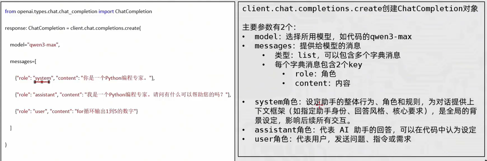
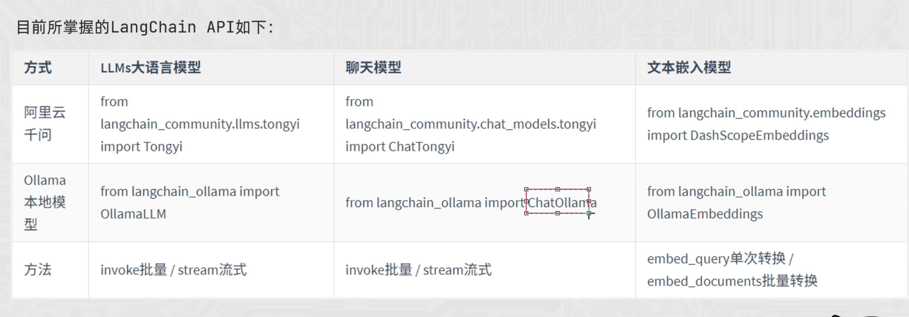
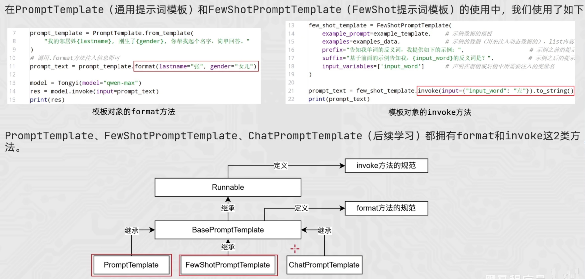
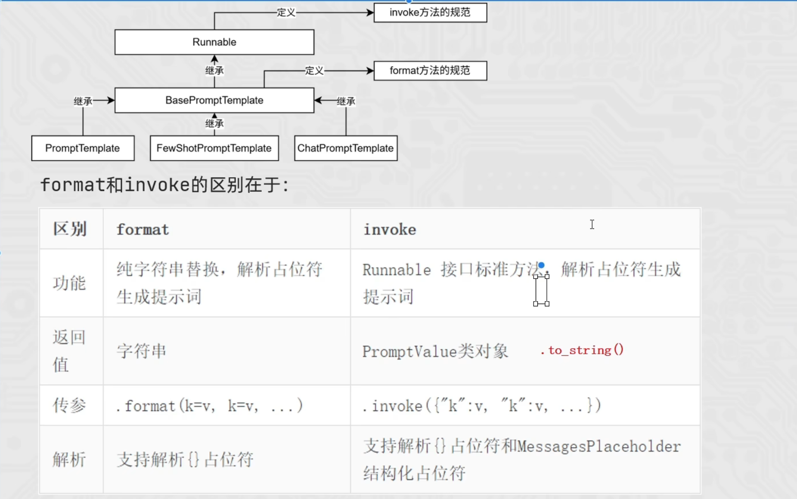
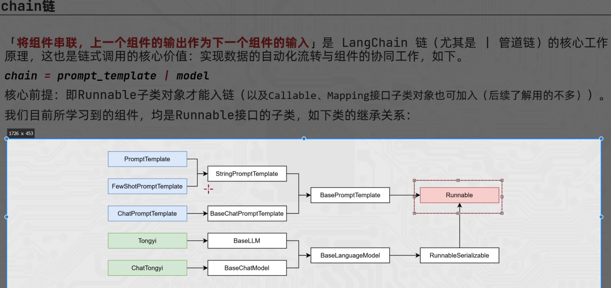
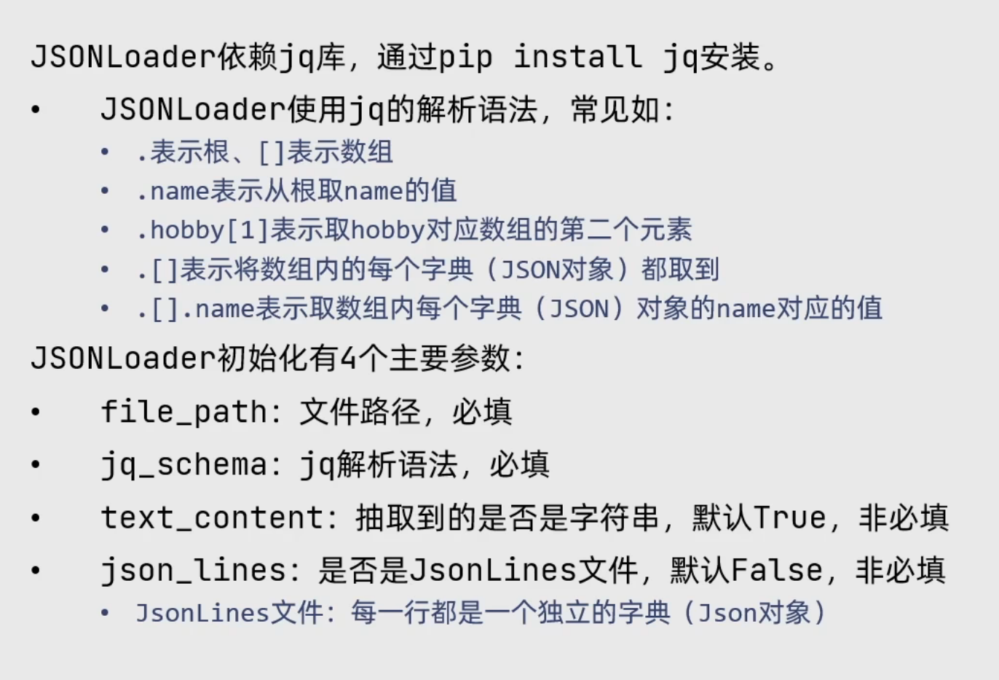
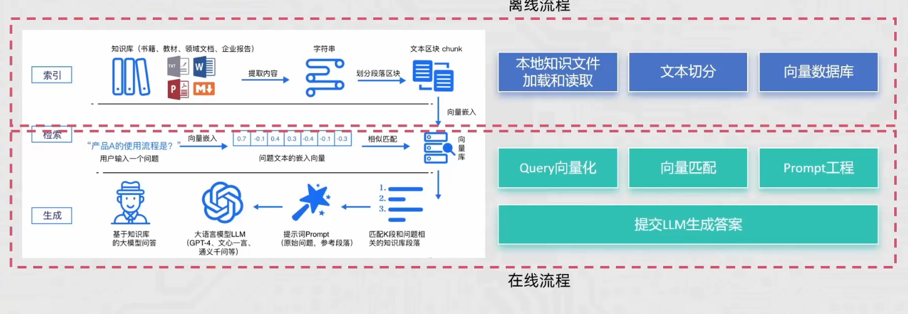

openai库的messages对象

调用大模型

promptTemplate

fomat和invoke的区别在于:

举例:
from langchain_core.prompts import FewShotPromptTemplate,PromptTemplate,ChatPromptTemplate
template=PromptTemplate.from_template("你是一个{role}，请回复{question}")
template.format(role="医生",question="我肚子疼")
template.invoke(input={"role":"医生","question":"我肚子疼"})
chain链的组件

jsonloader的使用

rag实现

rag就是在向模型提问之前,基于已有的知识库或文档做检索,确保向模型提问的内容更精准以及包含足够多的
信息量用以提供给模型.
